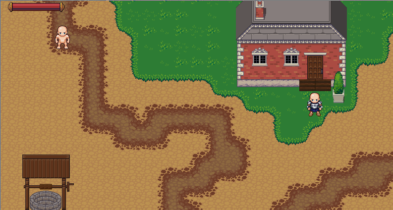
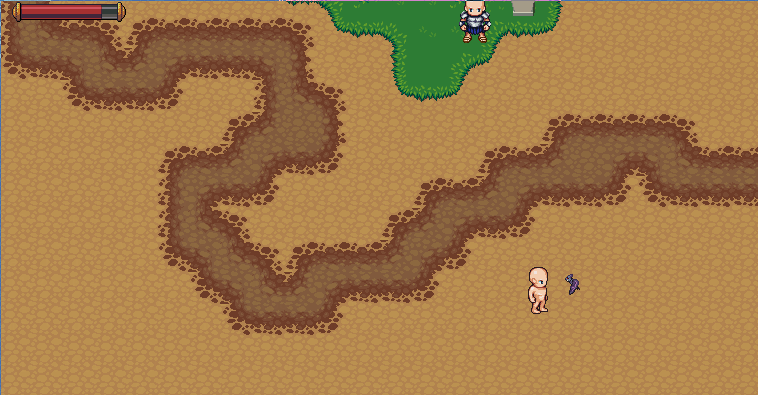
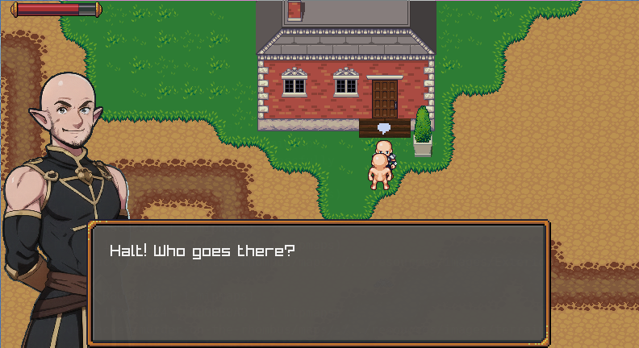

# A Rhombus in the Rough: Adventure Awaits!

This is a small libre RPG game built using the experimental [Rhombus
dialect](https://github.com/racket/rhombus-prototype) of the
scheme/lisp-based [Racket programming
language](https://github.com/racket/racket) &
[Raylib](https://www.raylib.com/sd), licensed under AGPLv3+.





The artwork for the game is based on submissions for the Libre Pixel Cup,
all under libre licenses, and the specific attribution is given in the
[attribution document](./attribution.md). 

If you think this looks cool, or want to find out more, or just
anything at all (please, I'm desperate), drop me a message, let me
know! I'd love to collaborate on libre projectssd!

## Stuff for PL Nerds

From a programming languages standpoint, if you're into that, this
project showcases the ease of writing macros and building DSLs in
Rhombus (a particular lang on top of Racket), and contains several
specialised DSLs for various parts of the game.

Some interesting DSLs in the project:

- [behaviours/monster.rhm](behaviours/monster.rhm)` -- A DSL for expressing behaviour trees for game AI:
  ```
  declare_behaviour_state(target,patrol)

  behaviour_tree attack_player(this) with state(target):
    all_of:
      check near_player(this) using state(target)
      perform do_attack_player(this, target)


  behaviour_tree aggro_player(this) with state(target):
    all_of:
      check player_in_line_of_sight(this) using state(target)
      perform aggro_towards_player(this,target)

  behaviour_tree follow_player(this) with state(target):
    all_of:
      check aggro_still_active(this, target)
      perform move_towards_player(this,target)

  behaviour_tree follow_patrol(this) with state(target, patrol):
    first_of:
      attack_player(this)
      follow_player(this)
      aggro_player(this)
      perform do_follow_patrol(this,patrol)
  ```

- [dialogs/guard.rhm](./dialogs/guard.rhm) -- A DSL for expressing dialog with branches and choices (inspired by other interactive scripting languages like Ink):
  ```
  dialog guard_dialog:
    guard_a: 1 "Halt! Who goes there?" || "Good ~a!" "day" || "Allo Allo..."
    1 "I'm a traveller, passing by" || "Hello again!" || "Just one more thing..."
    branch guard_a: "What do you want...."
    | "Nevermind...."
      ["The guard returns to his position."]
      ~> END
    | "I'd like to ask you a question"
    guard_a: "Sure! Fire away."
    branch
    | "Who are you?" ("") [" You ask about the guard himself..."]
      guard_a: "I'm a guard!"
      ~> quest
    | "What's up?"
      guard_a: "Noneya."
      "..."
      "what-"
      guard_a: "None-ya business."
      "..."
      "I'll be on my way then..."
      ~> END
  ```

- [maps/map1.rhm](./maps/map1.rhm) -- A DSL for describing game maps and placing entities within the game world:
  ```
  map Map1("./map1.tmx"):


    position "start-point":
      entity p :: Player

    position "in-front-of-house":
      entity blacksmith :: Blacksmith

    position "grassy-plain-area":
      entity bat :: Bat = build_bat():
        ~with_path "bat-patrol" in set_patrol

    init:
      #void
  ```

- [game/item_sprites.rhm](./game/item_sprites.rhm) -- A DSL for naming individual tiles within spritesheets:
  ```
  spritesheet ItemSprites:
    options:
      ~offset_x: 0.
      ~offset_y: 0.
      ~spacing_x: 0.
      ~spacing_y: 0.
      ~width: 34.0
      ~height: 34.0
      ~shared
    ARMOR_IRON ARMOR_COPPER ARMOR_BRONZE ARMOR_SILVER ARMOR_GOLD CLOTH CLOTH_GOLD MEDAL_GOLD MEDAL_SILVER MEDAL_BRONZE BLUE_STONE RED_PENDANT HEART_NECKLACE ICE_STAR_NECKLACE WINGS_NECKLACE HEALTH_POTION_NECKLACE
    TEETH_NECKLACE POTION_NECKLACE CROSS_NECKLACE CLOTH_BAND METAL_BAND CLOTH_SHOES LEATHER_SHOES REINFORCED_SHOES STRENGTHENED_SHOES SPEEDY_SHOES METAL_SHOES FOREIGN_SHOES LEATHER_HELMET GLADIATOR_HELMET KNIGHT_HELMET WIZARD_HELMET
    FIRE_WIZARD_HELMET MONSTER_PLATE MONSTER_BONE_SHIELD METAL_SHIELD GOLD_SHIELD ROUND_SHIELD BANDIT_SHIELD METAL_BRACELET REINFORCED_METAL_SHEILD GLADIATOR_SHIELD MIRROR_SHIELD ROBOTIC_SHIELD MONSTER_SHIELD MONSTER_KING_SHIELD WOODEN_SHIELD REINFORCED_WOODEN_SHIELD
  ```
